<div align="center">

# 🎮 Xplore Spine Admin Portal 🧠

**Web-based admin portal for the Xplore Spine educational gaming platform**

[](https://www.snke.com)
[](#)
[](#)
[](#)

</div>

---

## 🎯 Mission Control Center

> **🚀 The web-based admin portal for the Xplore Spine app**  
> Providing seamless access to instructor portals via Brainlab ID authentication  
> and serving as the login gateway for Xplore Spine users through in-game browsers.

### 🎮 Key Features

<div align="center">

| 🔐 | 📊 | 🎯 | ⚡ |
|:---:|:---:|:---:|:---:|
| **SAML Authentication** | **Real-time Analytics** | **Gaming Interface** | **Live Monitoring** |
| Enterprise-grade security | Learning progress tracking | Seamless in-game login | System health monitoring |

</div>

---

## 🏗️ System Architecture

<div align="center">


</div>

---

## 🛠️ Technology Stack

<div align="center">

[](https://nodejs.org/)
[](https://nestjs.com/)
[](https://www.typescriptlang.org/)
[](https://sqlite.org/)
[](#)

</div>

---

## 🚀 Quick Start

### Prerequisites

<div align="center">

| Requirement | Version | Purpose |
|-------------|---------|---------|
| **Node.js** | `v20.11.1` | ⚠️ **REQUIRED** - better-sqlite3 compatibility |
| **NVM** | Latest | Node version management |
| **1Password** | Latest | Secrets management |

</div>

### 🛠️ Installation

```bash
# 1. Clone and navigate
git clone <repository-url>
cd spinex-admin-portal

# 2. Install dependencies
cd server
npm install

# 3. Set up Node version (CRITICAL!)
nvm install v20.11.1
nvm use v20.11.1

# 4. Configure environment
# (See Configuration section below)
```

### 🔑 Secrets Setup

<div align="center">

> **🔐 Security First!**  
> All secrets are managed through 1Password vault: `Xplore Spine Brainlab ID Certs`

</div>

**Required Files:**
- `saml-brainlab.key` → `certs/` directory (gitignored)
- `saml-brainlab.crt` → `certs/` directory (gitignored)  
- `xplore-spine-env-config-dev` → Rename to `.env` in `server/` directory

---

## ⚙️ Configuration

### 🏗️ Development Environment

Create a `.env` file in the `server/` directory:

```bash
# Essential development settings
NODE_ENV=dev
DB_PATH=/valid/path/to/store/sqlite/database
HOST_NAME=localhost:3000

# SAML Certificate paths (point to your certs directory)
SAML_SP_CERT_PATH=/path/to/certs/saml-brainlab.crt
SAML_SP_KEY_PATH=/path/to/certs/saml-brainlab.key
```

> **💡 Pro Tip:** Setting `NODE_ENV=dev` bypasses SAML auth and uses mock users for local development!

### 🌐 Production Environment

<div align="center">

| Variable | Purpose | Example |
|----------|---------|---------|
| `PORT` | Web server port | `80` |
| `HOST_NAME` | Service hostname | `spinex.apps.snke.link` |
| `SAML_IDP_PUBLIC_KEY` | Identity provider public key | `-----BEGIN CERTIFICATE-----` |
| `DB_PATH` | SQLite database storage | `/var/lib/spinex/` |
| `SESSION_SECRET` | Session security | `your-secret-key` |

</div>

**Complete Production Variables:**

```bash
# Server Configuration
export PORT=80
export HOST_NAME=spinex.apps.snke.link
export DB_PATH=/var/lib/spinex/
export SESSION_SECRET=your-secret-key

# SAML Authentication
export SAML_IDP_PUBLIC_KEY="-----BEGIN CERTIFICATE-----"
export SAML_IDP_ENTRY=https://idp.brainlab.com/entity
export SAML_IDP_SLS=https://idp.brainlab.com/sls
export SAML_ACCOUNT_URL=https://account.brainlab.com
export SAML_SP_CERT_PATH=/path/to/certs/saml-brainlab.crt
export SAML_SP_KEY_PATH=/path/to/certs/saml-brainlab.key

# Email Configuration
export EMAIL_USER=your-email@gmail.com
export EMAIL_PASSWORD=your-app-password

# API Integrations
export BRAINLAB_API_URL=https://api.brainlab.com
export BRAINLAB_API_KEY=your-api-key
export BRAINLAB_API_AUTH=username:password
export LICENSE_API_URL=https://quotebase.brainlab.com
export LICENSE_API_KEY=your-license-key
export DATA_WAREHOUSE_KEY=your-warehouse-key
```

---

## 🚀 Deployment

### 🎯 Automated Deployment

<div align="center">

| Environment | Branch | URL | Status |
|-------------|--------|-----|--------|
| **Development** | `releases/dev` | [spinex-dev.apps.snke.link](https://spinex-dev.apps.snke.link/) |  |
| **Production** | `releases/prod` | [spinex.apps.snke.link](https://spinex.apps.snke.link/) |  |

</div>

**Deployment Process:**

```bash
# 1. Start from main branch
git pull origin main

# 2. Switch to release branch
git checkout releases/dev  # or releases/prod

# 3. Merge changes
git merge main

# 4. Deploy (triggers GitHub Actions)
git push origin releases/dev
```

> **⏱️ Deployment Time:** ~1 minute with <10 seconds downtime

**Monitor Deployments:** [GitHub Actions](https://github.com/LevelEx/spinex-admin-portal/actions)

### 🛠️ Manual Deployment

```bash
# Deploy to specific host
./deploy.sh spinex.v2.snke.link

# Ensure SSH key is loaded
ssh-add /path/to/your/privkey.pem
```

---

## 📊 Monitoring & Logs

### 📈 System Monitoring

<div align="center">


</div>

This application runs on **systemd** for automatic restarts and log management.

**View Logs:**

```bash
# Standard output logs
cat /var/log/spinex/out.log

# Error logs  
cat /var/log/spinex/err.log

# Real-time monitoring
tail -f /var/log/spinex/out.log
```

### 🔍 Health Checks

<div align="center">

| Check | Command | Expected Result |
|-------|---------|-----------------|
| **Service Status** | `systemctl status spinex` | `active (running)` |
| **Port Listening** | `netstat -tlnp \| grep :80` | `0.0.0.0:80` |
| **Database Access** | Check logs for SQLite errors | No errors |

</div>

---

## 🛡️ Security

### 🔐 Authentication Flow

```mermaid
graph TD
    A[👨‍⚕️ User Access] --> B[🔐 Brainlab ID Redirect]
    B --> C[📋 SAML Assertion]
    C --> D[✅ Certificate Validation]
    D --> E[🎫 Session Creation]
    E --> F[🚀 Portal Access]
    
    style A fill:#00D4AA,stroke:#333,stroke-width:2px,color:#fff
    style B fill:#007ACC,stroke:#333,stroke-width:2px,color:#fff
    style C fill:#6F42C1,stroke:#333,stroke-width:2px,color:#fff
    style D fill:#28A745,stroke:#333,stroke-width:2px,color:#fff
    style E fill:#FD7E14,stroke:#333,stroke-width:2px,color:#fff
    style F fill:#DC3545,stroke:#333,stroke-width:2px,color:#fff
```

<div align="center">



</div>

### 🛡️ Security Features

<div align="center">

| Feature | Status | Description |
|---------|--------|-------------|
| **SAML 2.0 Authentication** | 🟢 Active | Enterprise-grade security |
| **X.509 Certificate Validation** | 🟢 Active | Cryptographic verification |
| **Session Management** | 🟢 Active | Secure state handling |
| **HTTPS Enforcement** | 🟢 Active | Encrypted communications |
| **SQL Injection Protection** | 🟢 Active | Parameterized queries |

</div>

---

## 🤝 Contributing

### 🎯 Development Workflow

1. **Fork & Clone** → Create your development branch
2. **Environment Setup** → Follow configuration guide above
3. **Feature Development** → Build with medical education in mind
4. **Testing** → Ensure compatibility with gaming interface
5. **Pull Request** → Submit for review with clear description

### 🧪 Testing Guidelines

- **Unit Tests** → Core functionality verification
- **Integration Tests** → SAML authentication flow
- **E2E Tests** → Complete user journey validation
- **Security Tests** → Authentication bypass attempts

---

## 📚 Additional Resources

### 🔗 Links

<div align="center">

[](https://www.snke.com)
[](https://www.snke.com/products-services/)
[](notes/server-setup.md)
[](https://github.com/LevelEx/spinex-admin-portal/actions)

</div>

### 📖 Documentation

- **NestJS Framework** → [nestjs.com](https://nestjs.com/)
- **SAML Authentication** → [SAML 2.0 Specification](https://docs.oasis-open.org/security/saml/v2.0/)
- **Systemd Service** → [systemd.io](https://systemd.io/)

---

<div align="center">

[](https://www.snke.com)

</div>
